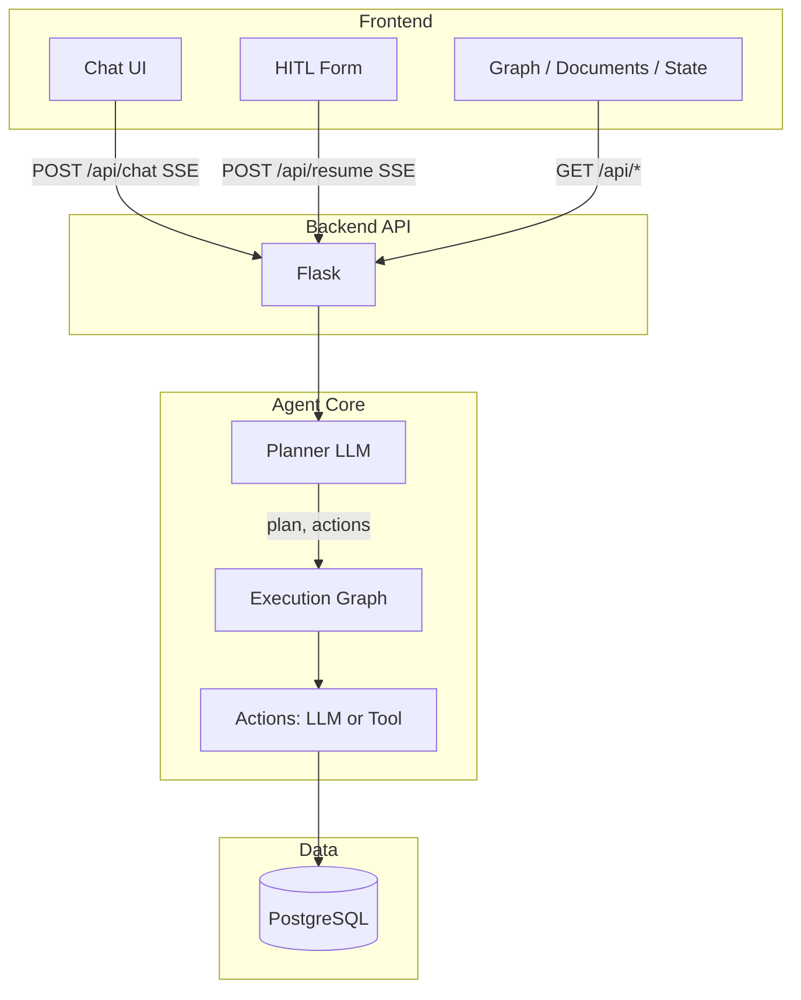

# DynaGraph

> A dynamic graph-based AI Agent orchestration framework for scalable, efficient, and transparent agent workflows.

## Overview

DynaGraph provides a standardized yet modular architecture for planning and executing multi-step tasks across diverse enterprise domains. The framework decomposes user requests into reusable action blocks, enabling automated task planning, execution with optional human-in-the-loop oversight, and transparent reasoning trace generation.

### Problem Statement

Organizations need AI systems that leverage shared infrastructure for efficiency while adapting to diverse operational contexts—without extensive custom development.

- **Redundant Development**: Enterprises rebuild similar patterns (task decomposition, orchestration, oversight) across projects
- **Limited Scalability**: Existing agent systems struggle to scale across multiple domains and workloads
- **Unpredictable Behavior**: Unconstrained AI autonomy leads to inconsistent outputs and unreliable system behavior


### Key Capabilities
- **Dynamic Plan generation** 
- **Modular Action Blocks** 
- **Human in the loop**
- **Tracing**

### Architecture

DynaGraph is structured in three layers:

- **Frontend** (React + Vite): Chat UI, HITL parameter form, plan/graph view, Vector DB document list, and state debug. Communicates with the backend via REST and Server-Sent Events (SSE) for streaming.
- **Backend API** (Flask): Session-per-conversation `ConversationAgent`; exposes `/api/chat` (SSE), `/api/resume` (SSE), `/api/conversation`, `/api/state`, `/api/graph`, `/api/documents`.
- **Agent core**: For each user message, a **planner** (LLM) produces a plan and a list of **actions** with execution order. An **execution graph** (LangGraph `StateGraph`) is built from those actions—nodes are action types (LLM or tool), edges follow execution order (with parallel fan-out/fan-in). Optional **HITL** interrupts before specified nodes; the user can adjust parameters and resume. Results are merged into conversation state and reused across turns (e.g. CONTEXT_REFERENCE). Actions are either **LLM-based** (prompt + model) or **tool-based** (e.g. SEARCH_TAVILY, SEARCH_DOCUMENT, SQL_GENERATION/SQL_EXECUTION). External data: **PostgreSQL** (vector DB for RAG, optional DB schema for SQL).


## Getting started

Run the backend, then the frontend:

```bash
# Backend (from repo root; port 5001 to avoid conflict with AirPlay on macOS)
pip install -r backend/requirements.txt
PYTHONPATH=. python -m backend.app
# or: FLASK_APP=backend.app:app PYTHONPATH=. flask run --port=5001

# Frontend (another terminal)
cd frontend && npm install && npm run dev
```

- **Backend**: http://localhost:5001 (default; use `PORT=5001` if needed; avoid 5000 on macOS—often used by AirPlay Receiver)
- **Frontend**: http://localhost:5173 (proxies `/api` to the backend)

The web UI provides chat (SSE), HITL parameter review, plan/graph view, Vector DB document list, and state debug. See [frontend/README.md](frontend/README.md) for routes and details.

## Technical details

Conversation memory, session/thread management, and RAG retrieval are described for implementers and maintainers in **[Technical Architecture](docs/technical-architecture.md)**. For vector DB setup and document indexing, see [Vector DB Setup](docs/vector-db-setup.md). The frontend (React + Vite) lives in `frontend/`; see [frontend/README.md](frontend/README.md) for its structure and API usage.

## Usecases


